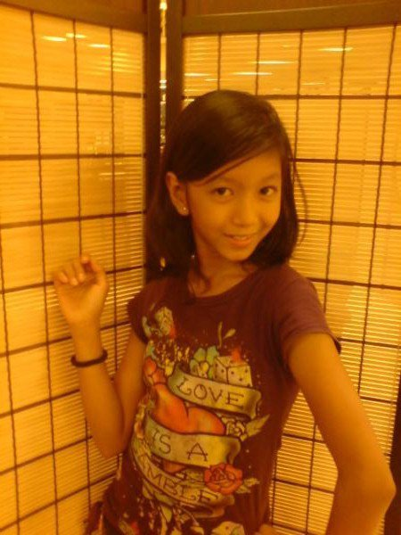

## Friendster as *the* Means
### *Invention*
After a year of being in Friendster, I started to learn how to manipulate this technology. I can still vividly remember my first year in high school. Friendster played a vital role in my life at that time, not because it allowed me to learn stuff for school, but because it was one of the most famous means to learn things I would like to call *LOL*.

This does not stand for laugh-out-loud antics. LOL pertains to *Landi OnLine*. I know, thinking about it now, I believe that this acronym suits the context so well because, as a 24-year old, I now realize how hilarious these years are. Imagine, a flat-chested kid,

with no idea about the real world, would think about how to start making *landi* with others. Don’t get me wrong. All my friends in Friendster are mostly from my school, so I guess it was safe enough to upload pictures and information about me. Besides, issues about privacy were not that prevalent before.

## How to LOL
### *Style*

Choose your weapons wisely.

When I paid attention to LOL, I became familiar with the Friendster background layout, music, and the design of my cursor.
All these were based on **how I want others to see me.** The questions in my mind during those times were:
- Does this background look cute?
- If I use this cursor, would others see me as attractive?
- How does this  background music add more “chicness” to my profile?

 I also learned how to choose what pictures I should upload and status I should post.
- If I choose to upload this picture wherein I am showing my teeth, would my classmates think I am pretty?

- What if I upload my gradeschool pictures?

Call for backup.

Aside from the design layout and the things I upload about myself, I was also concerned with how others see me in terms of  “**testimonials**.”
Testi or testimonials also mattered before. People can write comments about you, and during that time, I would usually ask my sister or my cousins, and close friends to write testi for me. However, there was a strict reminder: “*Ayusin niyo ha*.” I would ask them to write good stuff about me so that if anyone visited my page, they would see that I am an interesting person.

As you can see, these are all about the appearance I want to communicate with others. I was so obsessed with how my “*friends*” would see me as a freshman student. I needed to "belong" in this new school, and I wanted to be noticed by my schoolmates.

### *Arrangement*
Use your secret weapon.

In Friendster, there was an option in which you can see those people who viewed your profile. *Interesting, right? I wish Facebook has that.*

However, since I was now introduced to LOL, I became so addicted to checking if this person checked my profile.
- He did not view my page today.
- Does it mean he does not like me?
- Is he attracted to somebody else?

Whenever this would happen, I would immediately change my background music into something melancholic.



My intention was if this guy visited my page, he would notice that I was so sad that for the past few days that he did not check me out.

Of course, I also had a song if I saw that this person visited my profile.



Here is a picture of me during those times. Just a reminder of how I looked like.

This option also taught me the idea of “think before you click.” It was not Facebook who introduced this line, well, at least for me. Since Friendster has this option, I learned how to be careful when stalking other people. Of course, why would I, a *Landi-on-the-inside-but-shy-on-the-outside girl*, 

let people know that I am stalking them?

This is where it all started.
