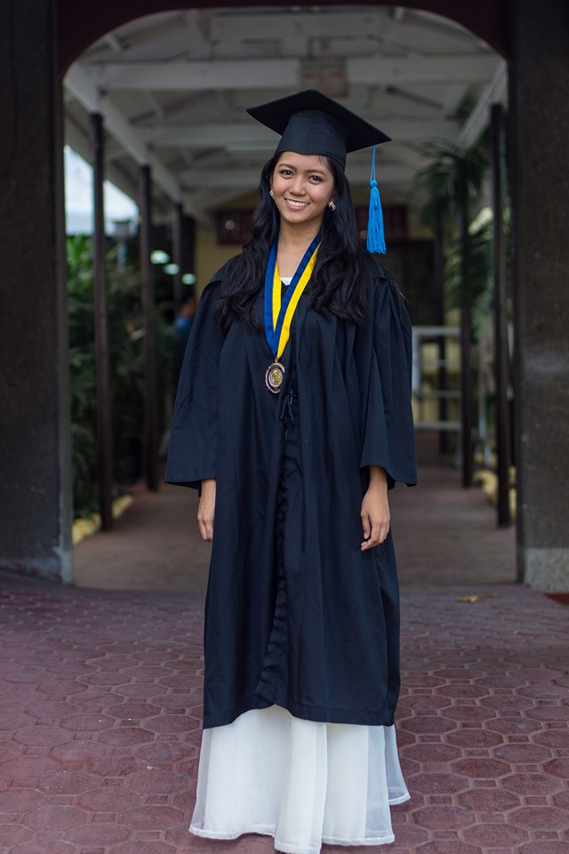
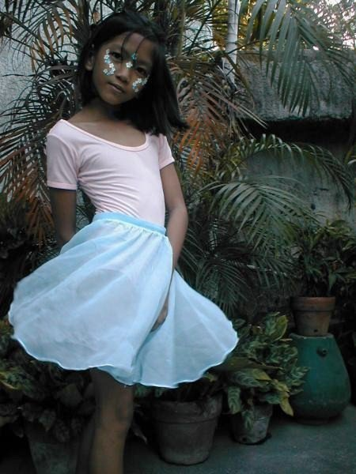
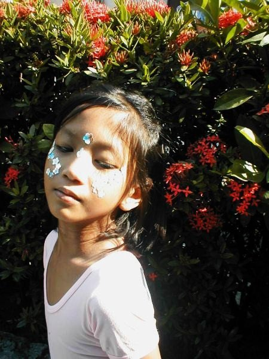
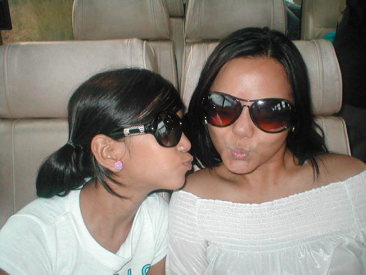
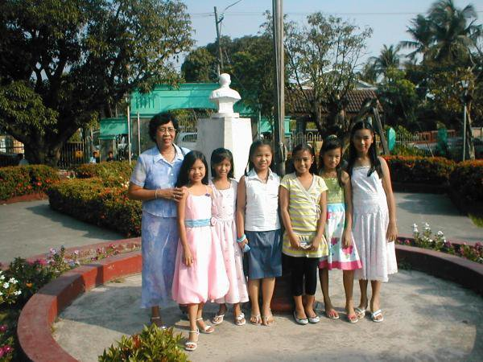
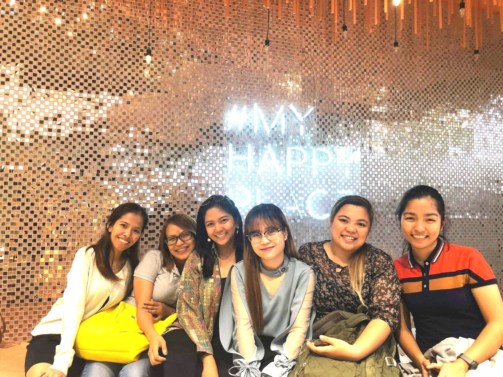
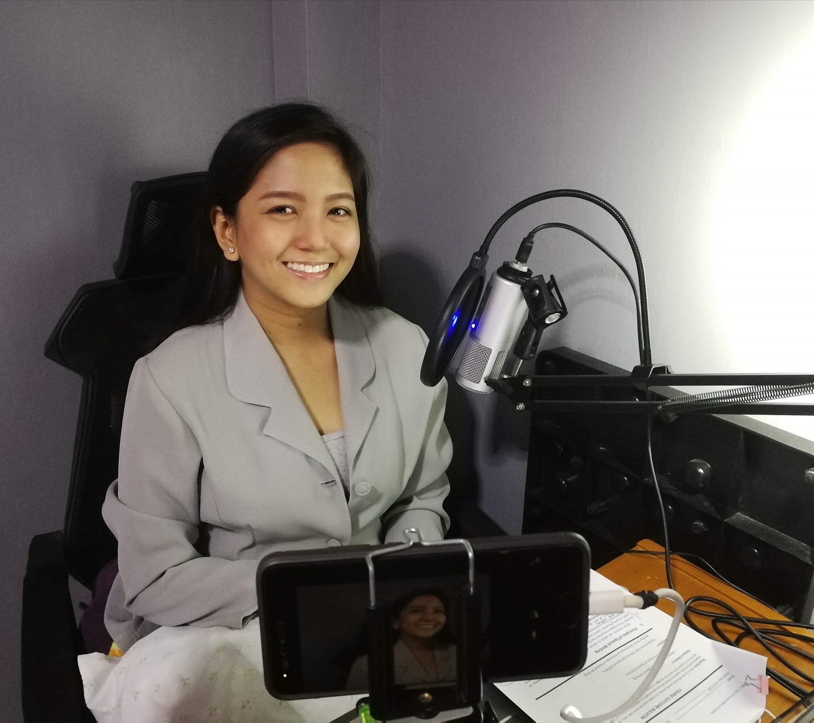

What is Friendster’s impact on me as a communicator?
Well, let’s give credit to this platform for allowing me to learn how to engage in conversations with others. However, I think that, because of my very young age, the impact was detrimental.

# False Representation of My Selves
## *Delivery*
As a communicator, it is essential that you engage in intrapersonal communication. Asking yourself questions about your identity matters because how you see yourself affects the way you present yourself. At a very young age, I did not know this. Instead of inside to outside communication, it was the other way around.
The way others saw me and communicated with me influenced the way I talked to myself. This is why I think that, despite the communication opportunities given by this platform, I still believe that the way I was introduced to it and how I manipulated it led to a false representation of myself.

### Who cares?
What if I represented myself different from who I really was?
You see, as a teenager, it really mattered. Until now, even though I can already decide for myself, and I do not depend on my sister anymore to set up my account, social media platforms are still significant contributors to how I perceive and present myself. This false representation did not end in Friendster. It happens on my Instagram and Facebook accounts.

# What Now?
## *Memory*
What can a 24-year old do differently?
I say, engage more in intrapersonal communication. With this, I will see myself through my own eyes and not through the likes, shares, and comments people will give me. Although Friendster is not available anymore, numerous social media platforms, which have somehow similar features, are now becoming part of our daily lives. As a 24-year-old lady who is now more able to reflect and analyze, I believe that I should become more conscious about these things. Allowing myself to engage in inner talk will boost my self-esteem. This confidence will be apparent in the things I post on my accounts.

I was able to retrieve my pictures from Friendster, and here is my promise for my selves.
The way I will present them will not be anchored in the network I am in, nor in the number of likes and comments I will get. Rather, this presentation is a reflection of who I really am-

## a grade conscious student

## a frustrated ballerina

## a model-wanna-be

## a daughter

## a sister

## a friend

## a teacher

