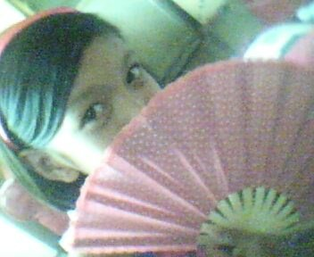

# Friendster as *the* Means
## *Invention*
After a year of being in Friendster, I started to learn how to manipulate this technology. I can still vividly remember my first year in high school. Friendster played a vital role in my life at that time, not because it allowed me to learn stuff for school, but because it was one of the most famous means to learn things I would like to call
### LOL.
This does not stand for laugh-out-loud antics. LOL pertains to *Landi OnLine*. I know, thinking about it now, I believe that this acronym suits the context so well because, as a 24-year old, I now realize how hilarious these years are. Imagine, a flat-chested kid,

with no idea about the real world, would think about how to start making *landi* with others. Don’t get me wrong. All my friends in Friendster are mostly from my school, so I guess it was safe enough to upload pictures and information about me. Besides, issues about privacy were not that prevalent before.

# How to LOL

## *Style*
### 1. Choose your weapons wisely.

When I paid attention to LOL, I became familiar with the Friendster background layout, music, and the design of my cursor.
All these were based on **how I want others to see me.** The questions in my mind during those times were:
•	Does this background look cute?
•	If I use this cursor, would others see me as attractive?
•	How does this  background music add more “chicness” to my profile?

 I also learned how to choose what pictures I should upload and status I should post. 
•	If I choose to upload this picture wherein I am showing my teeth, would my classmates think I am pretty?

•	What if I upload my gradeschool pictures?

### 2. Call for backup.

Aside from the design layout and the things I upload about myself, I was also concerned with how others see me in terms of  “**testimonials**.”
Testi or testimonials also mattered before. People can write comments about you, and during that time, I would usually ask my sister or my cousins, and close friends to write testi for me. However, there was a strict reminder: “*Ayusin niyo ha*.” I would ask them to write good stuff about me so that if anyone visited my page, they would see that I am an interesting person.

As you can see, these are all about the appearance I want to communicate with others. I was so obsessed with how my “*friends*” would see me as a freshman student.

## *Arrangement*
### 3. Use your secret weapon.

In Friendster, there was an option in which you can see those people who viewed your profile. *Interesting, right? I wish Facebook has that.*

However, since I was now introduced to LOL, I became so addicted to checking if this person checked my profile.
•	He did not view my page today.
•	Does it mean he does not like me?
•	Is he attracted to somebody else?

Whenever this would happen, I would immediately change my background music into something melancholic.



My intention was if this guy visited my page, he would notice that I was so sad that for the past few days that he did not check me out.

Of course, I also had a song if I saw that this person visited my profile.



Here is a picture of me during those times. Just a reminder of how I looked like.

This option also taught me the idea of “think before you click.” It was not Facebook who introduced this line, well, at least for me. Since Friendster has this option, I learned how to be careful when stalking other people. Of course, why would I, a *Landi-on-the-inside-but-shy-on-the-outside girl*, let people know that I am stalking them?

# False Representation of My Selves
## *Delivery*

What is Friendster’s impact on me as a communicator?
Well, let’s give credit to this platform for allowing me to learn how to engage in conversations with others. However, I think that, because of my very young age, the impact was detrimental.

**False representation.**
As a communicator, it is essential that you engage in intrapersonal communication. Asking yourself questions about your identity matters because how you see yourself affects the way you present yourself. At a very young age, I did not know this. Instead of inside to outside communication, it was the other way around.
The way others saw me and communicated with me influenced the way I talked to myself. This is why I think that, despite communication opportunities given by this platform, I still believe that the way I was introduced to it and how I manipulated it led to a false representation of myself.

### Who cares?
What if I represented myself different from who I really was?
You see, as a teenager, it really mattered. Until now, even though I can already decide for myself, and I do not depend on my sister anymore to set up my account, social media platforms are still significant contributors to how I perceive and present myself. This false representation did not end in Friendster. It happens on my Instagram and Facebook accounts.

# What Now?
## *Memory*
What can a 24-year old do differently?
I say, engage in more intrapersonal communication. With this, I will see myself through my own eyes and not through the likes, shares, and comments people will give me. Although Friendster is not available anymore, numerous social media platforms, which have somehow similar features, are now becoming part of our daily lives. As a 24-year-old lady who is now more able to reflect and analyze, I believe that I should become more conscious about these things. Allowing myself to engage in inner talk will boost my self-esteem. This confidence will be apparent in the things I post on my accounts. 

I was able to retrieve my pictures from Friendster, and here is my promise for my selves.
The way I will present them will not be anchored in the network I am in, nor in the number of likes and comments I will get. Rather, this presentation is a reflection of who I really am-

## an achiever/ a grade cosncious student

## a frustrated ballerina

## a model-wanna-be

## a daughter

## a sister

## a friend

## a teacher

and many more selves.

